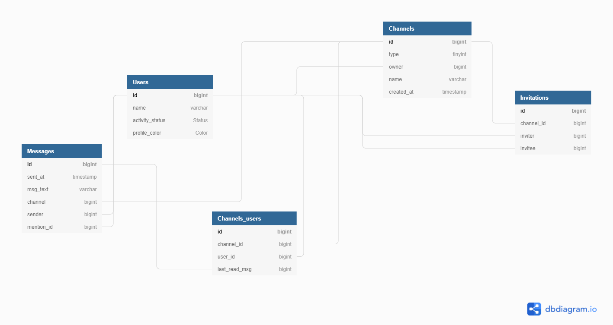

# Texthem IRC
Prototype of a progressive RTC web application

# Application use cases

1. Registration, login and logout of a user
2. User has the ability to see channels, in which the user is a member
    * after the user leaves or is kicked out of the channel, the user will no longer see the channel
    * user can create, leave a channel as he wishes (delete if he is the creater of the channel)
    * public and private channels
    * if there are no new messages in more than 30 days, channel is removed
3. User can send messages to a channel he is a member of, via a text box.
4. Console commands for easier administration for both users and admins.
    * **/join [channelName]** - user joins a public channel if exists. If a channel with a given *channelName* parameter dpes not exist, then a new private channel is created instead.
    * **/invite [nickName]** - invite a user to a private channel. 
    * **/revoke [nickName]** - remove a user from a private channel
    * **/kick [nickName]** - kick a user from a public channel. To permanently kick a user from a public channel, a portion of channels members must kick the wanted user. 
    * **/ban [nickName]** - bans a user and prevents him from further joining a channel (public/private). **ADMINISTRATOR COMMAND**
    * **/ban [nickName]** - revokes the ban from a user
    * **/quit** - closes the channel. **ADMINISTRATOR COMMAND**
    * **/cancel** - user cancels the membership and leaves the channel
    * **/list** - lists members in the current channel

5. Address different user with "@[nickName]" tag 
6. User can see all messages with implemented inifinity scroll
7. System based on notifications and three activity states (Online, Do Not Disturb, Offline)
    * **Online** - user receives all messages
    * **Do Not Disturb** - user does not receive notifications, but can still read messages
    * **Offline** - user does not receive messages and notifications. After setting the status to **online** mode, all channels are updated with the newest messages.
8. If a user is writing a message to a channel, another user can see the typed message as the first user is typing the message. This is done by clicking on the user nickname, who is currently writing a message.

# Database draft

